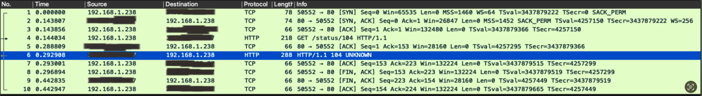
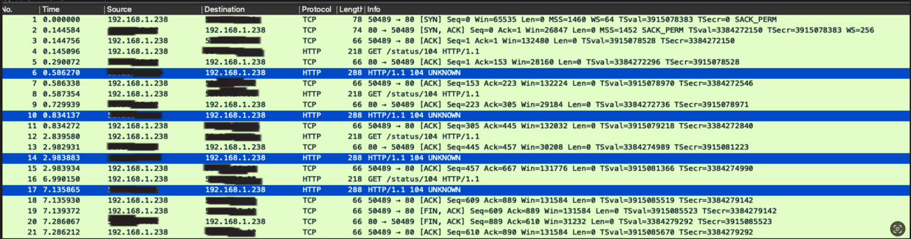

# Handling connection errors with python code
We are using thr requests module and we sometimes get connection errors.

This experiment is repeating this post: https://majornetwork.net/2022/04/handling-retries-in-python-requests/

and uses tcpdump to capture the packets. and wire shark to analyze them.

## Setting up the environment
We will use docker compose to run this container: kennethreitz/httpbin
It will allow us to simulate mock responses.
for instance, we can simulate a 104 error by sending a request to http://localhost:8000/status/104


## We are going to compare 2 retry strategies.
Using requests.adapters.HTTPAdapter and using urllib3.util.retry.Retry

### requests.adapters.HTTPAdapter
```python
import requests
from requests.adapters import HTTPAdapter
session = requests.Session()

session.mount("https://", HTTPAdapter(max_retries=5))
session.mount("http://", HTTPAdapter(max_retries=5))

session.get("http://httpbin.org/status/104")
```

### urllib3.util.retry.Retry
```python
import requests
from urllib3 import Retry
from requests.adapters import HTTPAdapter

session = requests.Session()
adapter = HTTPAdapter(
    max_retries=Retry(total=4, backoff_factor=1, allowed_methods=None, status_forcelist=[104, 107, 109]))
session.mount("http://", adapter)
session.mount("https://", adapter)

session.get("http://httpbin.org/status/104")
```

# Capturing the packats
we can run this command to capture the packets:
```bash
sudo tcpdump port 80 -w capturefile.pcap -v
```
and we can then use wireshark to analyze the packets.


# Results
When running the first option with requests.adapters.HTTPAdapter we get the following packets:



And when we us urllib3.util.retry.Retry we get the following packets:
